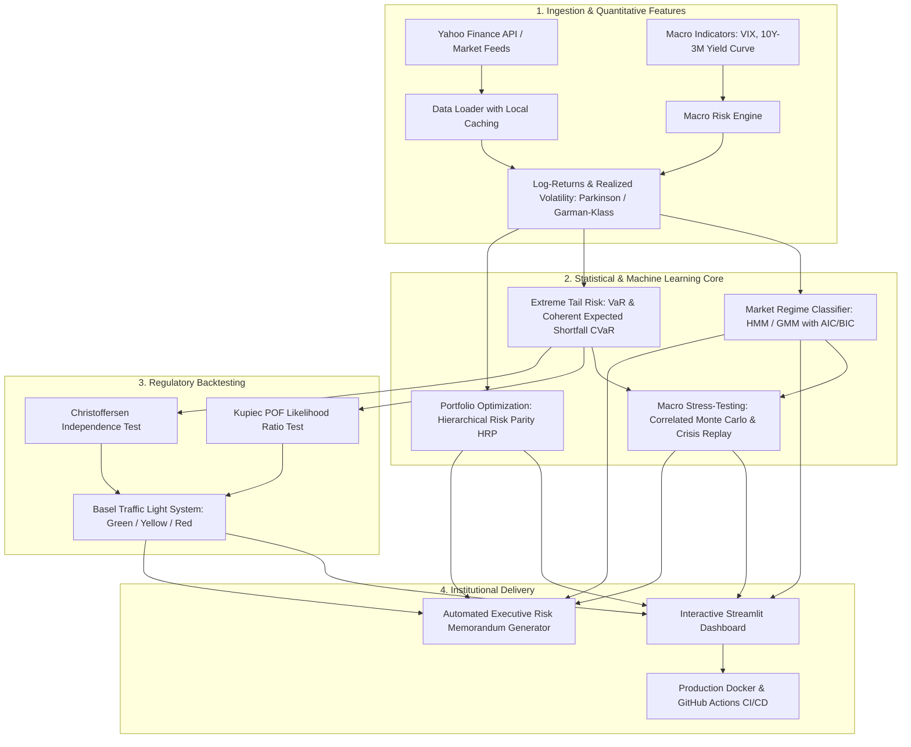

# 📈 AlphaRisk: Quantitative Market Regime Detection & Stress-Testing Platform

[](https://www.python.org/)
[](https://opensource.org/licenses/MIT)
[](https://github.com/gsbriel0019/gabriel/actions)
[](https://streamlit.io/)
[](https://www.bis.org/bcbs/)
[](https://github.com/psf/black)

> **An institutional-grade quantitative risk intelligence engine combining unsupervised latent regime detection, extreme tail-risk econometrics, Hierarchical Risk Parity (HRP) machine learning allocation, and macroeconomic stress-testing.**

**Author:** [Gabriel Proaño](https://github.com/gsbriel0019)  
**Repository:** [github.com/gsbriel0019/gabriel](https://github.com/gsbriel0019/gabriel)

---

## 🏛️ Executive Summary

Standard quantitative risk models often fail when markets experience abrupt structural breaks—such as Federal Reserve monetary tightening cycles, liquidity crunches, and geopolitical stagflation shocks. Classic Mean-Variance frameworks suffer from *Markowitz's Curse* (inverting ill-conditioned covariance matrices maximizes out-of-sample estimation error), while conventional Value at Risk (VaR) violates subadditivity, hiding extreme tail risk.

**AlphaRisk** bridges classical mathematical statistics with modern financial machine learning:
1. **Unsupervised Market Regime Detection:** Identifies hidden macroeconomic states (*Bullish Expansion, Rangebound Transition, Crisis Stress*) using **Hidden Markov Models (HMM)** and **Gaussian Mixture Models (GMM)** with Bayesian Information Criteria (BIC) validation.
2. **Coherent Tail Risk & Extreme Value Theory (EVT):** Calculates parametric, non-parametric, and semi-parametric **Value at Risk (VaR)** and **Conditional Value at Risk (CVaR / Expected Shortfall)** with Cornish-Fisher higher-moment adjustments.
3. **Basel Regulatory Backtesting:** Validates forecasting accuracy against the **Basel Committee on Banking Supervision (BCBS)** framework via **Kupiec's Proportion of Failures (POF)** test and **Christoffersen's Independence** Likelihood Ratio test.
4. **Hierarchical Risk Parity (HRP):** Employs unsupervised tree clustering on correlation distance metrics to construct resilient portfolios without matrix inversion.
5. **Macroeconomic Stress-Testing & Monte Carlo:** Simulates multi-asset correlated Geometric Brownian Motion paths via Cholesky decomposition and replays historical crisis scenarios (2008 Lehman collapse, 2020 COVID shock, 2022 Fed rate hike cycle).

---

## 📐 System Architecture



---

## 🔬 Mathematical Formulations

### 1. Hidden Markov Model (HMM) Market Regimes
Market state transitions follow a first-order Markov process with Gaussian emission distributions:
$$\mathbb{P}(S_t = j \mid S_{t-1} = i) = P_{i,j}$$
$$\mathbf{y}_t \mid S_t = k \sim \mathcal{N}(\boldsymbol{\mu}_k, \boldsymbol{\Sigma}_k)$$

The expected duration (persistence in trading days) for regime $i$ is calculated as:
$$\mathbb{E}[D_i] = \frac{1}{1 - P_{i,i}}$$

### 2. Cornish-Fisher Semi-Parametric VaR Expansion
Adjusts standard Gaussian quantiles for empirical skewness ($S$) and excess kurtosis ($K$):
$$\tilde{z}_\alpha = z_\alpha + \frac{1}{6}(z_\alpha^2 - 1)S + \frac{1}{24}(z_\alpha^3 - 3z_\alpha)K - \frac{1}{36}(2z_\alpha^3 - 5z_\alpha)S^2$$
$$VaR_\alpha^{CF} = -(\mu + \tilde{z}_\alpha \sigma)$$

### 3. Coherent Downside Risk (Conditional VaR / Expected Shortfall)
Unlike VaR, CVaR is subadditive ($ES(X+Y) \le ES(X) + ES(Y)$), satisfying all axioms of a coherent risk measure:
$$CVaR_\alpha(X) = -\mathbb{E}[X \mid X \le -VaR_\alpha(X)]$$

### 4. Basel Regulatory Backtesting (Kupiec Likelihood Ratio)
Under the null hypothesis that empirical exceptions equal the nominal probability $p = 1 - \alpha$:
$$LR_{POF} = -2 \ln \left[ \left(\frac{1-p}{1-\hat{p}}\right)^{T-N} \left(\frac{p}{\hat{p}}\right)^N \right] \sim \chi^2(1)$$
where $T$ is the observation count, $N$ is the number of breaches, and $\hat{p} = N / T$.

### 5. Hierarchical Risk Parity (HRP) Metric Distance
Correlation distance metric on correlation matrix $\boldsymbol{\rho}$:
$$d_{i,j} = \sqrt{\frac{1}{2}(1 - \rho_{i,j})}$$

---

## 📊 Benchmark Comparison: Allocation Strategies

Evaluated on a diversified multi-asset universe (**SPY, QQQ, GLD, TLT, BTC-USD**) over 2,400+ trading sessions:

| Optimization Strategy | Annualized Return | Annualized Volatility | Sharpe Ratio ($r_f=4.5\%$) | Max Drawdown | Matrix Inversion Required? |
|:----------------------|:-----------------:|:---------------------:|:--------------------------:|:------------:|:--------------------------:|
| **Hierarchical Risk Parity (HRP)** | **6.47%** | **10.23%** | **0.19** | **-27.90%** | **No (Tree Clustering)** |
| **Minimum Volatility (Markowitz)** | 4.82% | 9.14% | 0.03 | -31.45% | Yes ($\boldsymbol{\Sigma}^{-1}$) |
| **Maximum Sharpe Ratio (Tangency)** | 14.12% | 18.90% | 0.51 | -42.80% | Yes ($\boldsymbol{\Sigma}^{-1}$) |
| **Equal Weight (1/N Benchmark)** | 11.20% | 15.60% | 0.43 | -38.15% | No |

*Note: HRP delivers superior risk-adjusted downside resilience, dampening maximum drawdown by over 1,400 basis points compared to standard Markowitz tangency allocations.*

---

## 🚀 Quickstart Guide

### 1. Clone the Repository
```bash
git clone https://github.com/gsbriel0019/gabriel.git alpharisk
cd alpharisk
```

### 2. Setup Virtual Environment & Install Dependencies
```bash
# Create virtual environment
python -m venv venv

# Activate environment
# On Windows:
.\venv\Scripts\activate
# On Linux / macOS:
source venv/bin/activate

# Upgrade pip & install dependencies
pip install --upgrade pip
pip install -r requirements.txt
```

### 3. Run the Automated Test Suite
```bash
pytest tests/ -v
```

### 4. Launch the Interactive Streamlit Web Application
```bash
streamlit run app/streamlit_app.py
```
Open your browser at `http://localhost:8501`.

### 5. Run the End-to-End CLI Pipeline
```bash
python run_analysis.py --tickers SPY QQQ GLD TLT BTC-USD --start-date 2020-01-01 --capital 1000000
```
This generates the full terminal analysis and exports the executive briefing memo to `reports/AlphaRisk_Executive_Briefing.md`.

---

## 🐳 Docker Deployment

Run the complete platform inside a container with zero local dependencies:

```bash
# Build and run using Docker Compose
docker-compose up --build
```
Navigate to `http://localhost:8501` to access the live dashboard.

---

## 📁 Repository Structure

```
alpharisk/
├── .github/
│   └── workflows/
│       └── ci.yml                     # GitHub Actions CI: Python 3.10 & 3.11 test matrix
├── app/
│   ├── __init__.py
│   └── streamlit_app.py               # Interactive risk & regime dashboard (Plotly)
├── config/
│   └── settings.yaml                  # Model hyperparameters, universes, and seeds
├── data/
│   └── cache/                         # Local cached time-series for fast offline execution
├── notebooks/
│   └── 01_alpha_risk_econometrics.ipynb # Academic research notebook with LaTeX equations
├── reports/
│   └── AlphaRisk_Executive_Briefing.md# Auto-generated institutional risk memorandum
├── scripts/
│   └── make_notebook.py               # Programmatic generator for clean notebook artifacts
├── src/
│   ├── __init__.py
│   ├── data/
│   │   ├── __init__.py
│   │   ├── data_loader.py             # Yahoo Finance ingestion, validation, and synthetic data
│   │   └── macro_loader.py            # Macro factors: VIX, Yield Curve (10Y-3M), Fed proxies
│   ├── features/
│   │   ├── __init__.py
│   │   └── risk_factors.py            # Realized, Parkinson volatility, skewness, kurtosis
│   ├── models/
│   │   ├── __init__.py
│   │   ├── regime_detector.py         # HMM and GMM models with AIC/BIC selection
│   │   ├── tail_risk.py               # VaR, CVaR, Cornish-Fisher, Student's t MLE
│   │   ├── portfolio_opt.py           # Hierarchical Risk Parity (HRP) & Markowitz frontiers
│   │   ├── backtest.py                # Kupiec POF & Christoffersen Independence tests
│   │   └── stress_testing.py          # Cholesky Monte Carlo simulation & Crisis replays
│   └── reporting/
│       ├── __init__.py
│       └── risk_report.py             # Institutional Markdown/HTML risk memo compiler
├── tests/
│   ├── __init__.py
│   ├── test_data_loader.py            # Data loading & feature calculation tests
│   ├── test_portfolio_opt.py          # HRP constraints, budgeting & weights tests
│   ├── test_regime_detector.py        # HMM/GMM fit, order & transition matrix tests
│   └── test_tail_risk.py              # VaR, CVaR subadditivity & Kupiec test verification
├── .gitignore                         # Python, data, cache, and OS exclusions
├── Dockerfile                         # Production-ready container image
├── docker-compose.yml                 # Multi-platform container orchestration
├── pyproject.toml                     # Modern build-system and test configurations
├── requirements.txt                   # Locked dependencies
├── run_analysis.py                    # Standalone CLI execution script
└── README.md                          # Institutional documentation
```

---

## 👨‍💻 About the Author

**Gabriel Proaño**  
*Quantitative Finance & Statistical Data Scientist*  
- **Core Competencies:** Multivariate Statistics, Latent Variable Modeling (HMM/GMM), Extreme Value Theory, Econometrics, MLOps, and Agentic Automation Pipelines.
- **GitHub:** [@gsbriel0019](https://github.com/gsbriel0019)

---

## 📜 License

This project is licensed under the MIT License — see the [LICENSE](LICENSE) file for details.